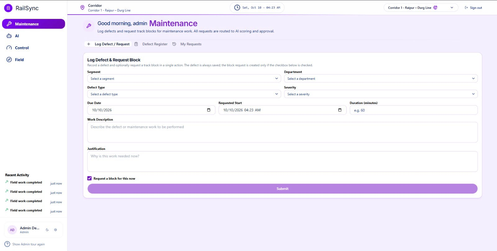
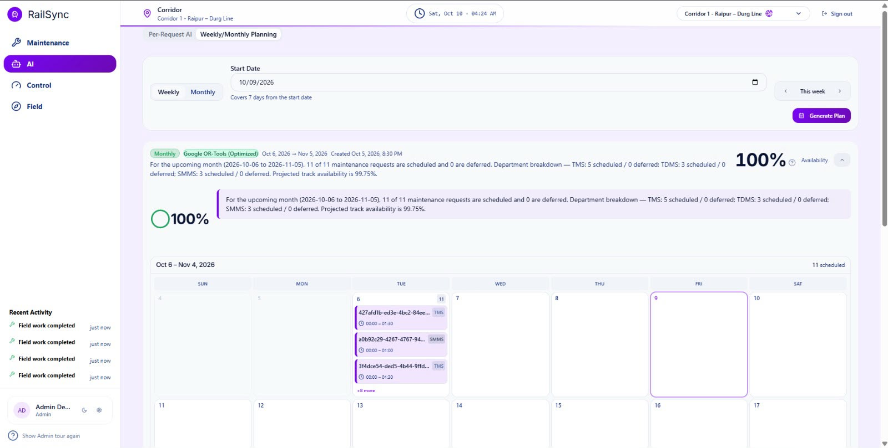
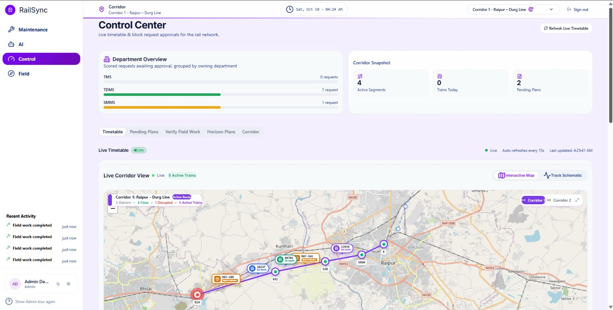
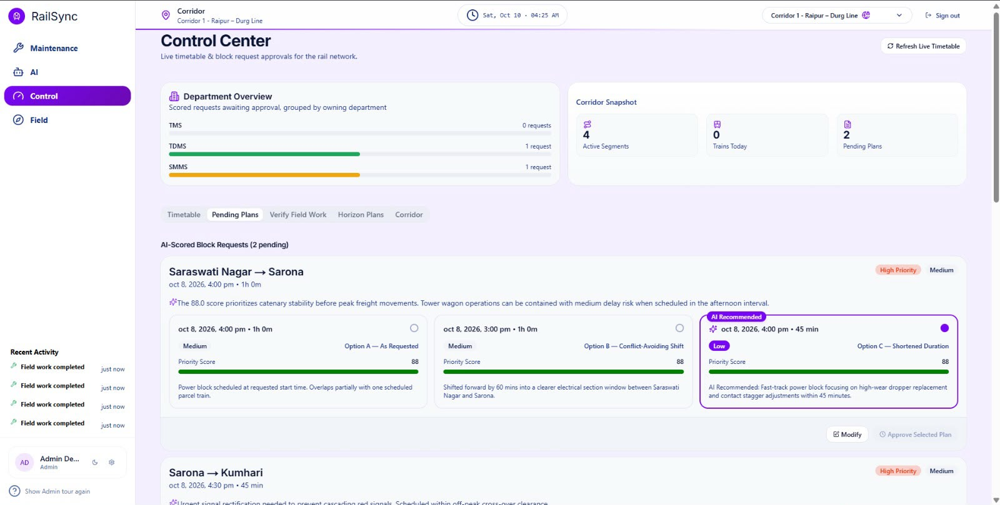
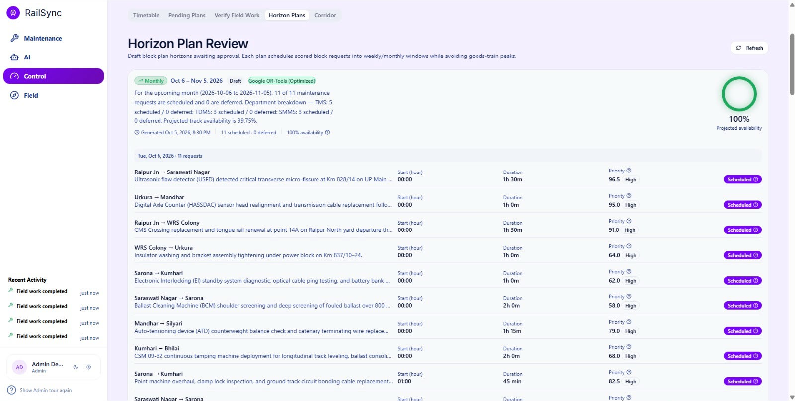
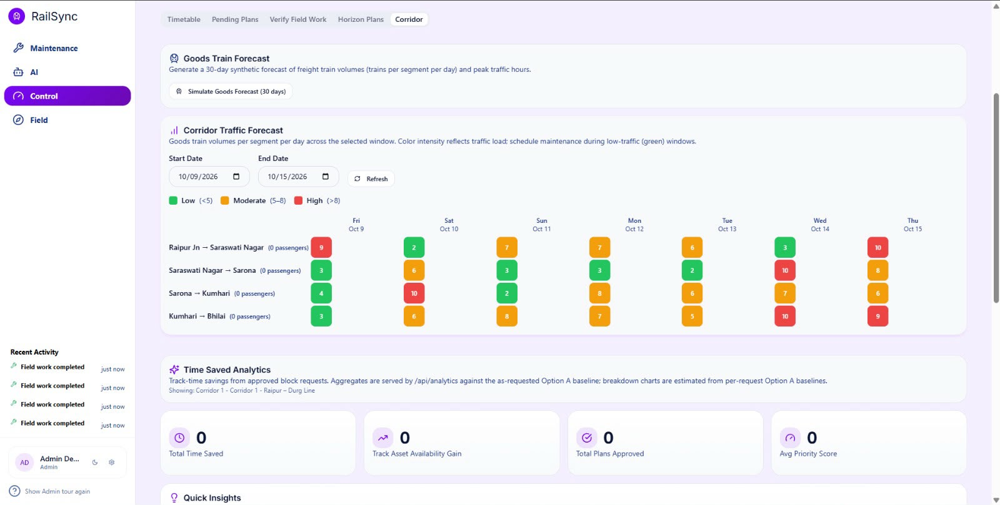
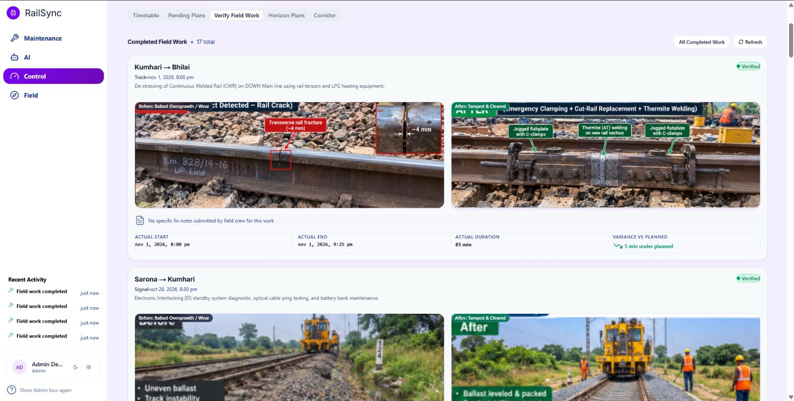
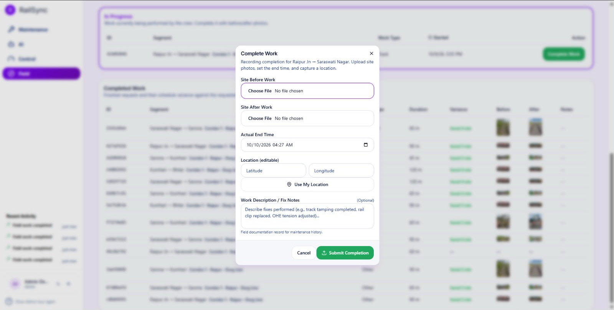
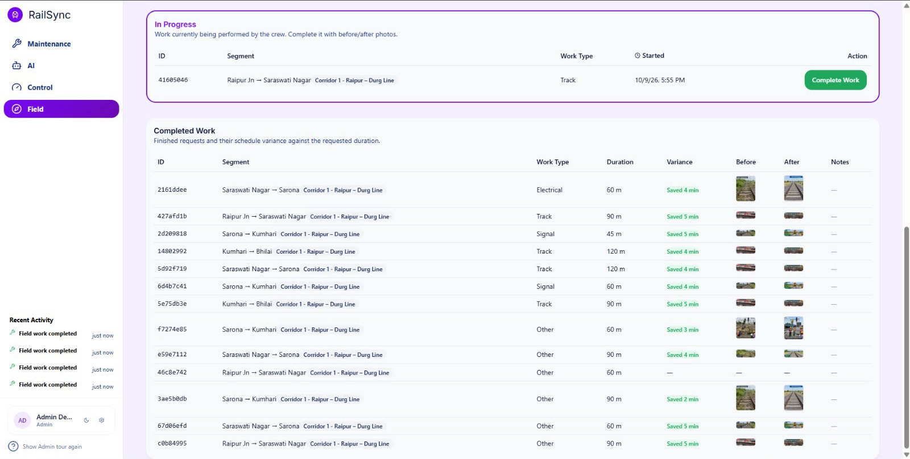

> **AI-powered unified platform for optimizing railway maintenance blocks with safety-first scheduling, live corridor tracking, and geo-tagged field verification.**

**Smart India Hackathon** · Team: _YOUR TEAM NAME_

---

## 🔗 Live Deployment

| Service | Link | Status |
| :--- | :--- | :--- |
| 🌐 **Live Website** | [railsync-red.vercel.app](https://railsync-red.vercel.app) | 🟢 Live |
| ⚙️ **ML Backend API** | [railsync-ml.onrender.com](https://railsync-ml.onrender.com) | 🟢 Live |
| 📂 **GitHub Repo** | [github.com/YOUR_USERNAME/railsync](https://github.com/Yash9109-0/railsync) | Public |

> ⏳ **Note:** The backend runs on Render's free tier, so the first request may take ~30 seconds to wake up (cold start).We have created cron-job which send request in every 10 seconds so our backend never goes in rest mode.

---

## 📖 Overview

Background: Railway maintenance for fixed infrastructure of Engineering, Traction Distribution, and Signal & Telecommunication departments is currently planned independently. Each department requests maintenance blocks/disconnections via the BDMS system. This planning process is decentralized and manual. This often leads to inefficient block utilization, poor coordination, and suboptimal scheduling,which may reduce asset availability and impact train operations. Detailed Description: Maintenance data-such as defects and overdue tasks—is maintained separately in systems like Track Management System (TMS), Signalling Maintenance & Management System (SMMS), and Traction Distribution Management System (TDMS). Meanwhile, the Control Office Application (COA) manages block corridor availability. Without integration and coordinated scheduling, maintenance blocks/disconnections are not optimally planned, resulting in asset downtime and reduced availability of fixed infrastructure for train operation.


We developed an Automatic Block Planning system that integrates maintenance, defects and corridor data to generate optimized block schedules. The system should prioritize maintenance activities to minimize asset downtime and maximize the availability of critical infrastructure, ensuring uninterrupted train operations. Expected Solution: Participants should build an Al system that includes:

1. Integration of maintenance data (defects, overdue maintenance) from TMS, SMMS, and TDMS with corridor block and block availability as per the Train Time Table and the goods trains forecast from the Control Office.

2. Uses AI/ML algorithms to prioritize and schedule maintenance tasks based on criticality, urgency, and impact on asset availability.

3. Optimize block scheduling to maximize asset uptime by minimizing downtime and efficiently coordinating multi-department activities.

4. Provides block plans over multiple time horizons-weekly and monthly—to support both short-term and long-term maintenance.

The solution should transform current decentralized and manual block planning into a data-driven, coordinated process that maximizes asset availability, improves safety, and supports reliable train operations.

Indian Railways struggles to coordinate maintenance blocks across multiple corridors(TMS/Track Maintenance System,SMMS/Signal Maintenance & Management System,TDMS/Traction Detection Maintenance System) without disrupting train operations. **RailSync** solves this with a connected 4-dashboard ecosystem:

1. **Maintenance Team** logs defects and requests track blocks.
2. **AI Engine** scores each request's priority and builds optimized Weekly/Monthly plans using **Google OR-Tools (CP-SAT)**.
3. **Control Center** approves or modifies blocks using the live timetable and interactive corridor map.
4. **Field Crew** executes the work and submits geo-tagged Before/After proof, which feeds back into the AI to improve its accuracy.

```
Maintenance Team ──► AI Engine ──► Control Center ──► Field Crew
      ▲                                                   │
      └────────── actual runtimes retrain the model ◄─────┘
```

---

## ✨ Key Features

### 1. 🛠️ Maintenance Dashboard
- **Unified Block Request** – Log a defect and request a track block in a single action. The defect is always saved; the block request is optional (checkbox).
- **Multi-Corridor System** – Supports Raipur–Durg and other corridors, with Segment, Department, Defect Type and Severity selection.
- **Downloadable Defect Register** – Export the full defect register as CSV for official records.
- **Dynamic Status Window** – Track *My Requests*: Pending → Approved → In Progress → Completed.
- **Auto Priority Score** – An ML model scores every request from 0–100:

  ```
  Score = Safety Risk×0.25 + Criticality×0.20 + Operational Impact×0.20
        + Severity×0.15 + Urgency×0.10 + Overdue×0.10
  ```

### 2. 🤖 AI Dashboard – The Brain
- **Long-term Weekly / Monthly Planning** – Pick a start date and generate a full 7-day or 30-day optimized maintenance calendar.
- **Google OR-Tools Optimized** – The CP-SAT solver scheduled **11 of 11 requests with 0 deferred** and a projected track availability of **99.75%** in our test run, with a department breakdown (TMS, TDMS, SMMS).
- **Coordinated Scheduling with Live Train Timetable** – Avoids goods-train peaks and passenger traffic.
- **Heuristic Fallback** – If OR-Tools cannot solve an over-constrained problem, the system automatically falls back to formula-based time-window scheduling, so planning never fails.
- **Calendar View** – All scheduled blocks shown by date, with department tags and durations.

### 3. 🎛️ Control Dashboard – For Section Controllers
- **Interactive Live Corridor Map** – Real-time Raipur–Durg line with active trains, live speeds, train IDs, and Clear/Occupied segments. Switch between Interactive Map and Track Schematic, and between corridors.
- **Approve / Modify Block Requests** – The AI gives 3 options per request:
  - **Option A** – As Requested
  - **Option B** – Conflict-Avoiding Shift
  - **Option C** – Shortened Duration *(AI Recommended)*

  The controller can modify time/duration or approve the selected plan.
- **Bulk Section Approval** – Approve all blocks of a whole section with one coordinated time window.
- **Available Time Windows** – Controllers can see free windows before approving.
- **Verify Field Work with GeoTag** – Compare Before/After photos with the location and Km marker.
- **Transparency of Work** – Every approval and work completion appears in the Recent Activity feed.
- **Horizon Plan Review** – Review draft weekly/monthly plans (scheduled/deferred counts, priority, duration, status) before approval.
- **Corridor Traffic Forecast** – Heatmap of goods-train volume per segment per day:
  🟢 Low (<5) · 🟠 Moderate (5–8) · 🔴 High (>8) — schedule work in green windows.
- **Time Saved Analytics** – Tracks Total Time Saved, Track Asset Availability Gain, Total Plans Approved and Avg Priority Score.

### 4. 👷 Field Dashboard – For Ground Staff
- **In-Progress Work** – List of jobs currently being performed by the crew.
- **Complete Work Flow** – Upload *Site Before Work* and *Site After Work* photos, set the Actual End Time, and capture location with **Use My Location** (latitude/longitude editable).
- **Work Description / Fix Notes** – Short description of how the work was fixed (e.g. track tamping completed, rail clip replaced, OHE tension adjusted).
- **Time Variance** – Shows variance vs planned (e.g. *Saved 4 min*) to measure efficiency.
- **Feedback Loop for AI** – Actual duration becomes historical runtime data to retrain the model, improving priority-score and duration accuracy.

---

## 📸 Screenshots

| Maintenance | AI Planning |
| :---: | :---: |
|  |  |

| Control – Live Map | Control – Pending Plans |
| :---: | :---: |
|  |  |

| Horizon Plan Review | Corridor Traffic Forecast |
| :---: | :---: |
|  |  |

| Verify Field Work (Control) | Field – Complete Work |
| :---: | :---: |
|  |  |

| Field – Completed Work & Time Variance |
| :---: |
|  |

---

## 🧠 How OR-Tools Planning Works

1. **Collect** – All pending block requests for the selected horizon (7 or 30 days) are pulled in with their priority score, duration, department and segment.
2. **Model** – Each request becomes an interval variable in the **CP-SAT** solver. Constraints include no overlapping blocks on the same segment, avoiding goods-train peak hours, and respecting the requested duration.
3. **Optimize** – The objective maximizes scheduled high-priority work while keeping **track availability** as high as possible.
4. **Fallback** – If the model is infeasible or over-constrained, a formula-based **heuristic (PAUT time-window)** scheduler takes over automatically.
5. **Review** – The draft plan goes to the Control Center, where the controller approves or modifies it.
6. **Learn** – Completed work reports actual runtimes, which retrain the ML model for better future predictions.

---

## 🛠️ Tech Stack

| Layer | Technologies |
| :--- | :--- |
| **Frontend** | Next.js 14, TypeScript, Tailwind CSS, Framer Motion, Leaflet / OpenStreetMap |
| **Backend** | FastAPI (Python), Supabase PostgreSQL |
| **AI / Optimization** | Google OR-Tools (CP-SAT Solver), Scikit-learn |
| **Deployment** | Vercel (Frontend), Render (Backend API) |
| **Other** | Mapbox, Real-time Train Simulation Engine |

---

🚀 Run Locally

💡 No setup needed to try it: open the live site at railsync-red.vercel.app. The steps below are only for running your own copy.

Prerequisites
Node.js 18 or newer
Python 3.10 or newer
A Supabase project (PostgreSQL database)
1. Clone the repository
bash
git clone https://github.com/Yash9109-0/railsync.git
cd railsync
2. Start the backend (FastAPI)
bash
cd backend
python -m venv venv

# Activate the virtual environment
source venv/bin/activate        # macOS / Linux
venv\Scripts\activate           # Windows

pip install -r requirements.txt
uvicorn main:app --reload       # runs at http://localhost:8000
3. Start the frontend (Next.js) in a new terminal
bash
cd frontend
npm install
npm run dev                     # runs at http://localhost:3000
4. Environment variables

Create these files before starting (never commit them to GitHub):

env
# backend/.env
SUPABASE_URL=your_supabase_url
SUPABASE_KEY=your_supabase_key

# frontend/.env.local
NEXT_PUBLIC_API_URL=http://localhost:8000

NEXT_PUBLIC_SUPABASE_URL=your_supabase_url

NEXT_PUBLIC_SUPABASE_ANON_KEY=your_supabase_anon_key

Then open http://localhost:3000 in your browser.

# 👥 Team 

Name	Role

Yash Sahu -	Database and integration of all team members' work

Ayushman Rai -	Backend, AI & ML setup and training

Abhinav Shrivastava -	Frontend and hosting

T Murli -	Build logs and deployment error handling
